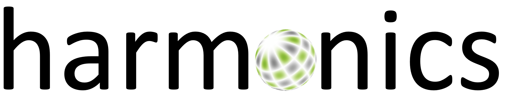

<!-- 
SPDX-FileCopyrightText: Copyright (c) 2022 The torch-harmonics Authors. All rights reserved.

SPDX-License-Identifier: BSD-3-Clause
 
Redistribution and use in source and binary forms, with or without
modification, are permitted provided that the following conditions are met:

1. Redistributions of source code must retain the above copyright notice, this
   list of conditions and the following disclaimer.
2. Redistributions in binary form must reproduce the above copyright notice,
   this list of conditions and the following disclaimer in the documentation
   and/or other materials provided with the distribution.

3. Neither the name of the copyright holder nor the names of its
   contributors may be used to endorse or promote products derived from
   this software without specific prior written permission.

THIS SOFTWARE IS PROVIDED BY THE COPYRIGHT HOLDERS AND CONTRIBUTORS "AS IS"
AND ANY EXPRESS OR IMPLIED WARRANTIES, INCLUDING, BUT NOT LIMITED TO, THE
IMPLIED WARRANTIES OF MERCHANTABILITY AND FITNESS FOR A PARTICULAR PURPOSE ARE
DISCLAIMED. IN NO EVENT SHALL THE COPYRIGHT HOLDER OR CONTRIBUTORS BE LIABLE
FOR ANY DIRECT, INDIRECT, INCIDENTAL, SPECIAL, EXEMPLARY, OR CONSEQUENTIAL
DAMAGES (INCLUDING, BUT NOT LIMITED TO, PROCUREMENT OF SUBSTITUTE GOODS OR
SERVICES; LOSS OF USE, DATA, OR PROFITS; OR BUSINESS INTERRUPTION) HOWEVER
CAUSED AND ON ANY THEORY OF LIABILITY, WHETHER IN CONTRACT, STRICT LIABILITY,
OR TORT (INCLUDING NEGLIGENCE OR OTHERWISE) ARISING IN ANY WAY OUT OF THE USE
OF THIS SOFTWARE, EVEN IF ADVISED OF THE POSSIBILITY OF SUCH DAMAGE.
-->

<p align="center">
    
</p>

<!-- # torch-harmonics: differentiable harmonic transforms -->

<!-- ## What is torch-harmonics? -->

Spherical Harmonic Transforms (SHTs) are the counterpart to Fourier transforms on the sphere. As such they are an invaluable tool for signal-processing on the sphere.

`torch_harmonics` is a differentiable implementation of the SHT in PyTorch. It uses quadrature rules to compute the projection onto the associated Legendre polynomials and FFTs for the projection onto the harmonic basis. This algorithm tends to outperform others with better asymptotic scaling for most practical purposes.

`torch_harmonics` uses PyTorch primitives to implement these operations, making it fully differentiable. Moreover, the quadrature can be distributed onto multiple ranks making it spatially distributed.

`torch_harmonics` has been used to implement a variety of differentiable PDE solvers which generated the animations below.


<table border="0" cellspacing="0" cellpadding="0">
    <tr>
        <td></td>
        <td></td>
        <td></td>
    </tr> 
<!--     <tr>
        <td style="text-align:center; border-style : hidden!important;">Shallow Water Eqns.</td>
        <td style="text-align:center; border-style : hidden!important;">Ginzburg-Landau Eqn.</td>
        <td style="text-align:center; border-style : hidden!important;">Allen-Cahn Eqn.</td>
    </tr>  -->
</table>


## Installation
Build in your environment using the Python package:

```
git clone git@github.com:NVIDIA/torch-harmonics.git
pip install ./torch_harmonics
```

Alternatively, use the Dockerfile to build your custom container after cloning:


```
git clone git@github.com:NVIDIA/torch-harmonics.git
cd torch_harmonics
docker build . -t torch_harmonics
docker run --gpus all -it --rm --ipc=host --ulimit memlock=-1 --ulimit stack=67108864 torch_harmonics
```

## Contributors

 - Boris Bonev (bbonev@nvidia.com)
 - Christian Hundt (chundt@nvidia.com)
 - Thorsten Kurth (tkurth@nvidia.com)
 - Nikola Kovachki (nkovachki@nvidia.com)

## Implementation
The implementation follows the paper "Efficient spherical harmonic transforms aimed at pseudospectral numerical simulations", N. Schaeffer, G3: Geochemistry, Geophysics, Geosystems. 

### Spherical harmonic transform

The truncated series expansion of a function $f$ defined on the surface of a sphere can be written as

$$
f(\theta, \lambda) = \sum_{m=-M}^{M} \exp(im\lambda) \sum_{n=|m|}^{M} F_n^m \bar{P}_n^m (\cos \theta),
$$

where $\theta$ is the colatitude, $\lambda$ the longitude, $\bar{P}_n^m$ the normalized, associated Legendre polynomials and $F_n^m$, the expansion coefficient associated to the mode $(m,n)$.

A direct spherical harmonic transform can be accomplished by a Fourier transform

$$
F^m(\theta) = \frac{1}{2 \pi} \int_{0}^{2\pi} f(\theta, \lambda) \exp(-im\lambda)  \mathrm{d}\lambda
$$

in longitude and a Legendre transform

$$
F_n^m = \frac{1}{2} \int_{-1}^1 F^m(\theta) \bar{P}_n^m(\cos \theta)  \mathrm{d} \cos \theta
$$

in latitude.

### Discrete Legendre transform

in order to apply the Legendre transfor, we shall use Gauss-Legendre points in the latitudinal direction. The integral

$$
F_n^m = \int_{0}^\pi F^m(\theta) \bar{P}_n^m(\cos \theta) \sin \theta \mathrm{d} \theta
$$

is approximated by the sum

$$
F_n^m = \sum_{j=1}^{N_\theta} F^m(\theta_j) \bar{P}_n^m(\cos \theta_j) w_j
$$

## Usage

### Getting started

The main functionality of `torch_harmonics` is provided in the form of `torch.nn.Modules` for composability. A minimum example is given by:

```python
import torch
import torch_harmonics as th

device = torch.device('cuda' if torch.cuda.is_available() else 'cpu')

nlat = 512
nlon = 2*nlat
batch_size = 32
signal = torch.randn(batch_size, nlat, nlon)

# transform data on an equiangular grid
sht = th.RealSHT(nlat, nlon, grid="equiangular").to(device).float()

coeffs = sht(signal)
```

`torch_harmonics` also implements a distributed variant of the SHT located in `torch-harmonics.distributed`.

## References

<a id="1">[1]</a> 
Schaeffer, N.;
Efficient spherical harmonic transforms aimed at pseudospectral numerical simulations;
G3: Geochemistry, Geophysics, Geosystems, 2013.

<a id="1">[2]</a> 
Wang, B., Wang, L., Xie, Z.;
Accurate calculation of spherical and vector spherical harmonic expansions via spectral element grids;
Adv Comput Math, 2018.
